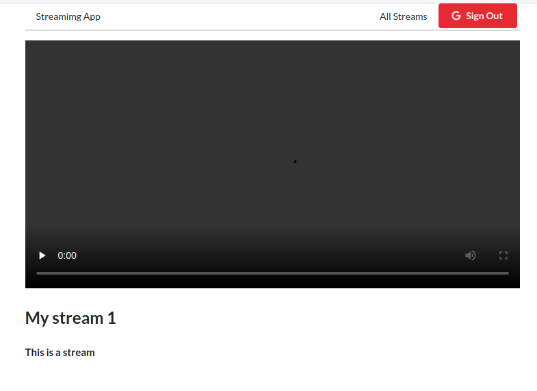
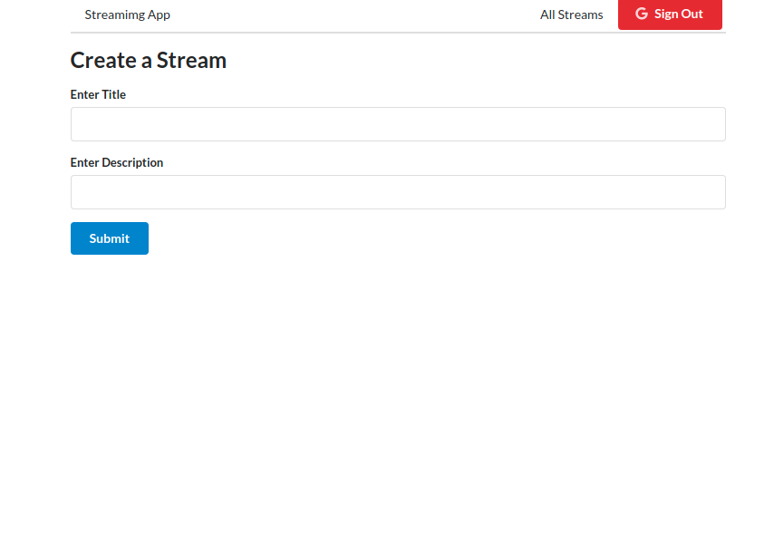
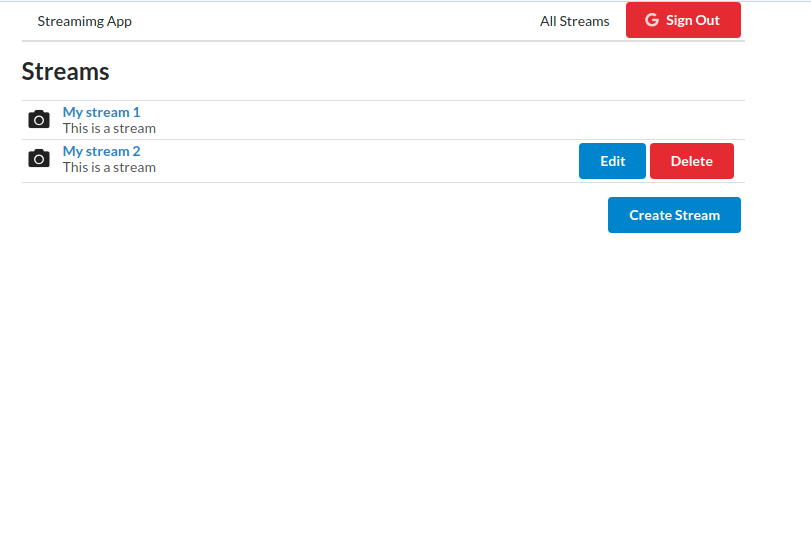

# Simple React Streaming app

## Table of Contents

- [About the Project](#about-the-project)
  - [Built With](#built-with)
- [Getting Started](#getting-started)
  - [Prerequisites](#prerequisites)
  - [Installation](#installation)
- [Usage](#usage)
- [Contributing](#contributing)
- [License](#license)
- [Contact](#contact)

## About The Project

This is a simple react streaming application with google authentication

**Screenshots**





### Built With

- [React](https://reactjs.org)
- [Redux](https://redux.js.org)
- [Node-Media-Server](https://github.com/illuspas/Node-Media-Server)
- [JSON Server](https://github.com/typicode/json-server)

## Getting Started

### Prerequisites

- Node
- NPM

### Installation

1. Clone the project

   ```bash
   git clone https://github.com/mayurvarma14/simple-streaming-app.git
   ```

2. Install packages

   ```bash
   cd simple-streaming-app

   npm install
   ```

3. Create `.env.local` file in `client` folder

   ```bash
    REACT_APP_CLIENT_ID=<google client id>
   ```

4. Create `db.json` file in `server` folder

   ```json
   {
     "streams": []
   }
   ```

## Usage

```bash
npm run frontend
npm run backend
npm run media-server
```

**Frontend** http://localhost:3001

**Backend** http://localhost:3002

**Media Server Admin Panel** http://localhost:8000/admin

## Contributing

1. Fork the Project
2. Create your Feature Branch (`git checkout -b feature/AmazingFeature`)
3. Commit your Changes (`git commit -m 'Add some AmazingFeature'`)
4. Push to the Branch (`git push origin feature/AmazingFeature`)
5. Open a Pull Request

## License

Distributed under the MIT License. See `LICENSE` for more information.

## Contact

Mayur Varma
